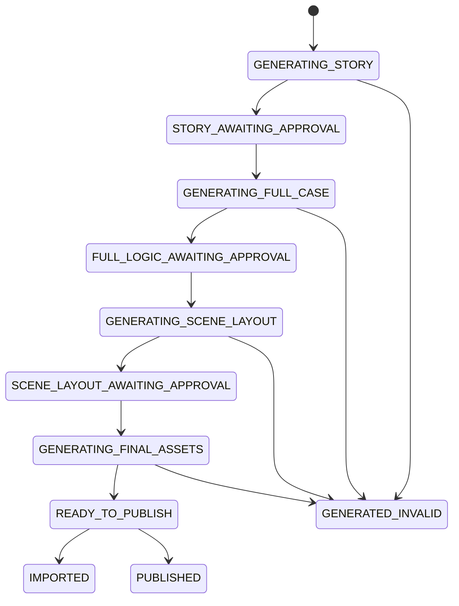
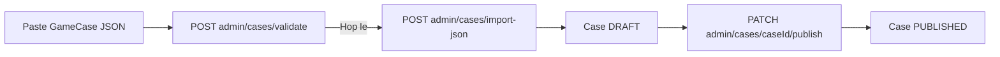
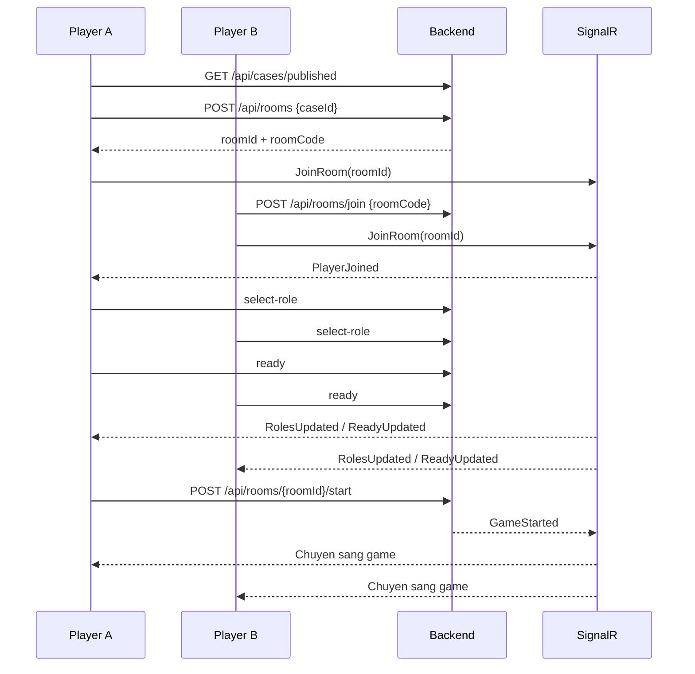

# Flow tao case va choi game hien tai

Cap nhat theo code ngay 2026-06-18.

Tai lieu nay mo ta luong dang chay trong backend va frontend, khong chi dua tren
cac tai lieu thiet ke cu. Hai nguon su that chinh la:

- Case va gameplay: backend luu trang thai chinh xac trong MongoDB.
- Giao dien: frontend gui command, nhan SignalR event, sau do refetch state tu API.

## 1. Tong quan

```mermaid
flowchart LR
    A[ADMIN hoac VIP tao AI draft] --> B[Duyet story preview]
    B --> C[Duyet full case logic]
    C --> D[Duyet scene layout]
    D --> E[Tao final assets]
    E --> F[ADMIN import va publish]
    F --> G[Player chon published case]
    G --> H[Tao room 2 nguoi]
    H --> I[Chon 2 role va ready]
    I --> J[Host start game]
    J --> K[Dieu tra scene]
    K --> L[Mo clue va scene tiep theo]
    L --> M[Final accusation]
    M --> N[WON hoac FAILED]
```



## 2. Du lieu cot loi

### `GameCase`

Mot case hoan chinh gom:

- Thong tin chung: `caseId`, `title`, `summary`, `status`,
  `generationMode`, `estimatedMinutes`, `coverImageUrl`.
- `stages[]`: sap xep theo `order`.
- Moi stage co `scenes[]`.
- Moi scene co background, item, character, hotspot, placement/runtime va
  `completeCondition`.
- `characters[]`, `items[]`, `clues[]`, `dialogues[]`.
- `finalLogic`: culprit, motive, method, required evidence va ending.

Case chi duoc tao room khi `status = PUBLISHED`.

### `GameRoom`

Room luu:

- Case dang choi.
- Host.
- Toi da hai player.
- Role va ready state cua tung player.
- `LobbyVersion` de tranh ghi de khi hai request lobby chay dong thoi.
- `GameplayState` sau khi game bat dau.

### `GameplayState`

State dung chung cua team:

- Item da inspect/collect.
- Clue da capture/unlock.
- Dialogue da hoi.
- Scene/stage da hoan thanh.
- Evidence da chon.
- Game status va version.

State rieng theo player:

- `PlayerSceneIds[userId]`: scene hien tai cua tung nguoi.

Vi vay hai player co the dung o hai scene da mo khac nhau, nhung clue, item,
dialogue va tien do case van la state dung chung.

## 3. Flow tao case bang AI

### Quyen

| Hanh dong | ADMIN | VIP |
|---|---:|---:|
| Tao story preview | Co | Co |
| Duyet draft do minh tao | Co | Co |
| Xem draft cua nguoi khac | Co | Khong |
| Liet ke tat ca draft | Co | Khong |
| Import/publish draft | Co | Khong |

VIP tao va duyet noi dung/asset duoc, nhung ADMIN phai thuc hien buoc publish.

### State machine



### Buoc 1: Tao story preview

Frontend:

- Route: `#/admin/ai`
- Goi `POST /api/admin/ai-cases`.

Input:

```json
{
  "prompt": "Mo ta vu an mong muon",
  "stageCount": 4,
  "difficulty": "medium"
}
```

Backend:

1. Tao `AiCaseDraft` voi status `GENERATING_STORY`.
2. Goi OpenAI de tao preview khong spoiler.
3. Luu `storyPreview`.
4. Chuyen status thanh `STORY_AWAITING_APPROVAL`.

Preview chua co culprit, method, solution va final evidence.

### Buoc 2: Duyet story va tao full logic

Endpoint:

- `POST /api/admin/ai-cases/{draftId}/approve`

Backend:

1. Chi chap nhan draft `STORY_AWAITING_APPROVAL`.
2. Chuyen sang `GENERATING_FULL_CASE`.
3. Goi OpenAI tao full `GameCase`.
4. Parse JSON, ep `status = DRAFT`, chay auto-repair.
5. Validate full logic.
6. Neu invalid, goi OpenAI sua mot lan voi validation feedback.
7. Neu hop le, luu JSON va chuyen sang `FULL_LOGIC_AWAITING_APPROVAL`.
8. Neu van loi, luu attempt vao `GeneratedCaseJson/_invalid-ai` va chuyen
   `GENERATED_INVALID`.

### Nhanh sua full logic

Trong `FULL_LOGIC_AWAITING_APPROVAL`, creator co the tao candidate sua:

- `POST /{draftId}/repair-full-logic`
- `POST /{draftId}/accept-repair`
- `POST /{draftId}/reject-repair`

Candidate khong ghi de JSON hien tai cho den khi duoc accept. Neu dang co candidate
hop le chua accept/reject thi khong the approve full logic.

### Buoc 3: Duyet full logic va tao scene layout

Endpoint:

- `POST /api/admin/ai-cases/{draftId}/approve-full-logic`

Backend:

1. Validate lai full logic.
2. Chuyen `GENERATING_SCENE_LAYOUT`.
3. Tao cover.
4. Tao background `1600x900` cho tung scene.
5. Goi vision de lap `placementPlan` tu background va scene JSON.
6. Build runtime so bo gom walkable area, spawn point, placement, clue zone va
   transition.
7. Validate scene layout.
8. Export bundle checkpoint.
9. Chuyen `SCENE_LAYOUT_AWAITING_APPROVAL`.

Asset nam tai:

`src/FE/public/assets/ai-generated/v3-placement-first/{caseSlug}/`

Bundle JSON nam tai:

`src/BE/GeneratedCaseJson/{timestamp}-{caseId}-{draftId}/`

### Buoc 4: Duyet layout va tao final assets

Endpoint:

- `POST /api/admin/ai-cases/{draftId}/approve-scene-layout`

Backend:

1. Chuyen `GENERATING_FINAL_ASSETS`.
2. Tao portrait cho character.
3. Tao sprite rieng cho moi character trong moi scene.
4. Tao item cutout cho item puzzle can asset rieng.
5. Normalize cutout va alpha.
6. Dung vision verify placement.
7. Build runtime cuoi.
8. Validate toan bo case va kha nang playthrough.
9. Export bundle cuoi.
10. Chuyen `READY_TO_PUBLISH`.

Voi case `CAMERA_EMBEDDED`, clue vat ly thuong nam san trong background va duoc
mo bang camera. Item asset rieng chi duoc tao cho puzzle object hop le.

### Buoc 5: Import va publish

Chi ADMIN:

- Import draft: `POST /api/admin/ai-cases/{draftId}/import?overwrite=true`
- Import va publish:
  `POST /api/admin/ai-cases/{draftId}/publish?overwrite=true`

Dieu kien:

- Draft phai la `READY_TO_PUBLISH`.
- Full publish validation phai pass.
- Cac safety flag khong duoc chan import/publish.

Import luu case vao collection `gameCases` voi status `DRAFT`. Publish chuyen case
thanh `PUBLISHED`, sau do player moi nhin thay va tao room duoc.

### Resume va regenerate

- `POST /{draftId}/continue` tiep tuc dua theo status/checkpoint hien tai.
- `POST /{draftId}/regenerate-assets` tao lai scene layout voi
  `forceRegenerate = true`.

Luu y:

- `continue` co the tu `FULL_LOGIC_AWAITING_APPROVAL` di thang sang tao layout,
  hoac tu `SCENE_LAYOUT_AWAITING_APPROVAL` sang final assets.
- Backend co endpoint `regenerate-assets`, nhung `aiCaseApi.js` hien chua expose
  nut nay tren UI.
- `AI_DRY_RUN`, `SKIP_ASSET_GENERATION`, `GENERATE_JSON_ONLY` va `VALIDATE_ONLY`
  co the chan asset calls.
- `AI_DRY_RUN`, `DISABLE_AUTO_PUBLISH` va `VALIDATE_ONLY` co the chan
  import/publish.

### Flow import case thu cong

ADMIN cung co the bo qua AI:



## 4. Flow tao room va vao game



### Tao room

Player chon case tu:

- `#/cases`
- `#/cases/{caseId}`
- `#/create-room`

Frontend goi `POST /api/rooms`.

Backend chi tao room neu case `PUBLISHED`, sinh room code 6 ky tu va dat creator
lam host.

### Join room

Player B nhap room code tai `#/join`.

Backend tu choi neu:

- Room khong ton tai.
- Room da `IN_PROGRESS` hoac `COMPLETED`.
- Room da du hai nguoi.

Join lai cung user la idempotent.

### Lobby

Hai role bat buoc va khong duoc trung:

- `INVESTIGATOR`
- `INTERROGATOR`

Doi role se reset `IsReady = false`.

Room chuyen `READY` khi du hai nguoi va ca hai ready. Chi host duoc start.

Khi start, backend khoi tao:

- Stage dau theo `stage.order`.
- Scene dau cua stage do.
- Ca hai `PlayerSceneIds` cung tro vao scene dau.
- `VisitedSceneIds` chua scene dau.
- `UnlockedSceneIds` chi chua scene dau.
- `Version = 1`.
- Room `IN_PROGRESS`.
- Game `IN_PROGRESS`.

## 5. Flow gameplay

### Nguyen tac authority

Frontend khong gui full state. Frontend chi gui command:

- Inspect item.
- Capture clue.
- Ask dialogue.
- Complete scene.
- Di den scene da mo.
- Accuse.

Backend validate, ghi MongoDB, tang `gameplayState.version`, ghi action log va
phat SignalR event.

Frontend coi `GameStateUpdated` la tin hieu de goi lai:

- `GET /api/game/rooms/{roomId}/state`

Payload state duoc build theo user, vi moi user co scene hien tai rieng.

### Di chuyen trong scene

Phaser render background, player, NPC, item, clue zones va transition.

- Vi tri local duoc gui bang SignalR `UpdatePlayerPose`.
- Player con lai nhan `PlayerPoseUpdated`.
- Pose chi la realtime visual, khong luu vao gameplay state.
- Reconnect se join lai room group va refetch state.
- Pose khong tu mo clue, khong hoan thanh scene va khong duoc dung lam backend
  authority.

### Investigator

#### Inspect item

Endpoint:

- `POST /api/game/rooms/{roomId}/inspect-item`

Backend kiem tra:

- Player la member va game dang chay.
- Role la `INVESTIGATOR`.
- Item ton tai trong scene hien tai cua player.
- Hotspot khong bi khoa boi `requiredClueIds`.

Thanh cong:

- Them `InspectedItemIds`.
- Neu collectible, them `CollectedItemIds`.
- Mo cac clue trong `item.unlockClueIds`.
- Tang version, log va broadcast.

Inspect lai la idempotent.

#### Chup clue bang camera

Endpoint multipart:

- `POST /api/game/rooms/{roomId}/capture-clue`

Frontend gui:

- `sceneId`
- `captureRect`
- Anh `evidence.webp`

Backend so capture rect voi `scene.runtime.clueZones`:

- `MISS`: khong trung zone dang kha dung.
- `NEAR_MISS`: co trung nhung chua du coverage/center.
- `HIT`: luu anh, them `CapturedClueIds`, mo clue va broadcast state.

Clue zone chi kha dung khi cac `requiredClueIds` cua zone da duoc mo.

Anh evidence duoc lay lai qua:

- `GET /api/game/rooms/{roomId}/clues/{clueId}/photo`

### Interrogator

#### Ask dialogue

Endpoint:

- `POST /api/game/rooms/{roomId}/ask-dialogue`

Backend kiem tra:

- Role la `INTERROGATOR`.
- Character cua dialogue co trong scene hien tai cua player.
- Tat ca `dialogue.requiredClueIds` da mo.

Thanh cong:

- Them `AskedDialogueIds`.
- Mo `dialogue.unlockClueIds`.
- Tang version, log va broadcast.

Hoi lai la idempotent va tra lai cung answer.

### Hanh dong dung chung

#### Present evidence

Endpoint:

- `POST /api/game/rooms/{roomId}/present-evidence`

Hien tai day la action nhe:

- Bat buoc clue da unlock.
- Chi log va broadcast `EvidencePresented`.
- Khong thay doi `GameplayState`.
- Frontend gameplay hien chua co flow chinh su dung action nay.

#### Complete scene

Endpoint:

- `POST /api/game/rooms/{roomId}/complete-scene`

Backend danh gia `completeCondition` bang:

- Item da inspect.
- Clue da unlock.
- Dialogue da hoi.

`AND` yeu cau tat ca. `OR` yeu cau it nhat mot nhom requirement khong rong duoc
hoan thanh day du.

Neu chua du, backend tra danh sach item/clue/dialogue con thieu.

Neu du:

1. Them scene vao `CompletedSceneIds`.
2. Mo scene ke tiep theo thu tu authored: `stage.order`, sau do thu tu trong
   `scenes[]`. Khong tu dong visit scene nay cho ca team.
3. Them scene ke tiep vao `VisitedSceneIds` khi player vua bam continue di vao.
4. Chi cap nhat `PlayerSceneIds` cua player vua bam continue.
5. Player con lai van o scene cu va co the bam continue sau, ke ca khi teammate
   da complete scene.
6. Phat `SceneChanged`; phat them `StageChanged` neu scene ke tiep nam o stage moi.

Neu scene da duoc teammate complete, player con lai bam continue se duoc dua sang
scene ke tiep neu scene do da mo.

`interaction.unlockSceneIds` va `puzzle.unlockSceneIds` van co the mo mot scene
o xa som hon thu tu authored. Viec mo som khong tu visit scene va khong di chuyen
player nao.

Scene cuoi khong co successor: player giu nguyen vi tri. Final confrontation chi
mo khi tat ca scene trong case da complete va cac dieu kien accusation khac deu du.

`complete-stage` chi la endpoint xac nhan idempotent; tien do that nam o
`complete-scene`.

#### Quay lai scene

Endpoint:

- `POST /api/game/rooms/{roomId}/go-to-scene`

Chi duoc di den scene da co trong `VisitedSceneIds` hoac `UnlockedSceneIds`. Scene
da visit luon co the quay lai. Scene da unlock nhung chua visit co the duoc chon;
khi vao, backend them scene vao `VisitedSceneIds`. Backend chi thay
`PlayerSceneIds` cua user dang goi, nen hai nguoi co the tach scene.

Map hien scene locked la dia diem chua biet, khong lo title va khong cho click.

## 6. Final accusation va ket qua

Accusation chi mo khi player dang:

- O scene cuoi cua stage cuoi.
- Tat ca scene cua tat ca stage da complete.
- Tat ca `finalLogic.requiredEvidenceIds` da unlock.
- Game van `IN_PROGRESS`.

Endpoint:

- `POST /api/game/rooms/{roomId}/accuse`

Frontend hien tai gui:

- `culpritId`
- Danh sach `evidenceIds`
- `motive` va `method` dang de rong.

Backend chi tinh dung dua tren:

1. `culpritId == finalLogic.culpritId`.
2. Evidence gui len chua tat ca required evidence.

Ca dung va sai deu ket thuc room:

- Dung: `GameStatus = WON`.
- Sai: `GameStatus = FAILED`.
- Room: `COMPLETED`.
- Tao `GameResult`.
- Broadcast `GameCompleted`.
- Frontend chuyen sang `#/result/{roomId}`.

Trang result hien accusation cua player va su that cua case, gom culprit, motive
va method.

## 7. Realtime events

Lobby:

- `PlayerJoined`
- `PlayerLeft`
- `RolesUpdated`
- `ReadyUpdated`
- `GameStarted`

Gameplay:

- `GameStateUpdated`
- `ItemFound`
- `ClueUnlocked`
- `DialogueAnswered`
- `EvidencePresented`
- `SceneChanged`
- `StageChanged`
- `GameCompleted`

Movement:

- Client invoke `UpdatePlayerPose`.
- Client nhan `PlayerPoseUpdated`.
- Khi disconnect/leave nhan `PlayerPoseLeft`.

## 8. Noi can sua khi them feature

Mot feature gameplay moi thuong can di qua cac lop sau:

1. **Case contract**: them field vao `Models/GameCase.cs`.
2. **Validation**: them rule vao `CaseValidationService`.
3. **Runtime state**: neu can luu tien do, them field vao `GameplayState`.
4. **DTO/API**: them request/response va endpoint.
5. **Backend command**: xu ly trong `GameplayService` voi optimistic concurrency.
6. **Realtime**: them event vao `IGameNotifier` va `GameNotifier` neu teammate can
   phan hoi ngay.
7. **State projection**: expose du lieu player duoc phep thay trong
   `GameStateBuilder`.
8. **Frontend API**: them method vao `Client/js/api`.
9. **Phaser/UI**: them interaction, overlay va render state trong `gamePage.ts`.
10. **AI pipeline**: cap nhat prompt, auto-repair va validator neu AI phai sinh
    field moi.
11. **Tests**: them rule/service test cho command va complete condition.

### Mau them mot action moi

```text
Player interaction
  -> frontend kiem tra UX so bo
  -> POST command
  -> backend kiem tra member/role/scene/requirement
  -> mutate GameplayState
  -> optimistic save theo version
  -> action log
  -> detail realtime event
  -> GameStateUpdated
  -> cac client refetch state
```

## 9. File tham chieu chinh

- `src/BE/Services/AiCaseService.cs`
- `src/BE/Services/CaseValidationService.cs`
- `src/BE/Services/CaseService.cs`
- `src/BE/Services/RoomService.cs`
- `src/BE/Services/GameplayService.cs`
- `src/BE/Services/GameStateBuilder.cs`
- `src/BE/Models/GameCase.cs`
- `src/BE/Models/GameRoom.cs`
- `src/BE/WebAPI/Hubs/GameHub.cs`
- `src/FE/Client/js/pages/adminAiPage.js`
- `src/FE/Client/js/pages/lobbyPage.js`
- `src/FE/Client/js/pages/gamePage.ts`

